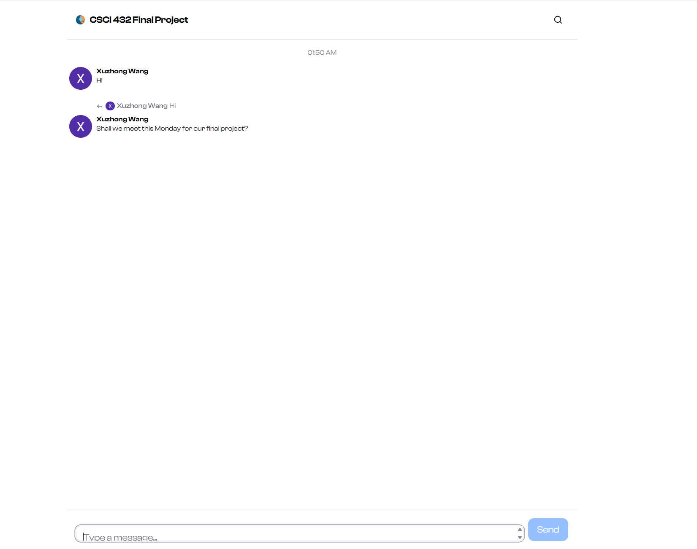
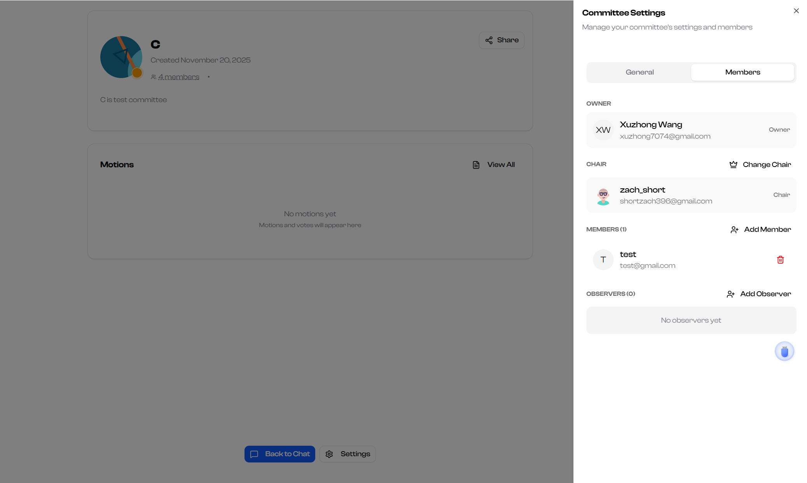
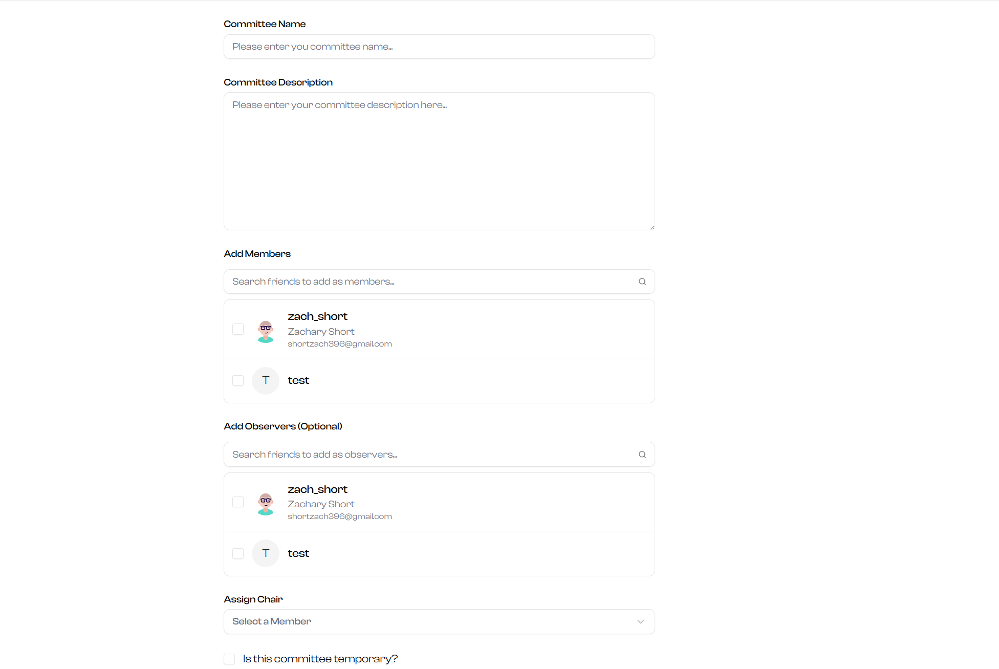
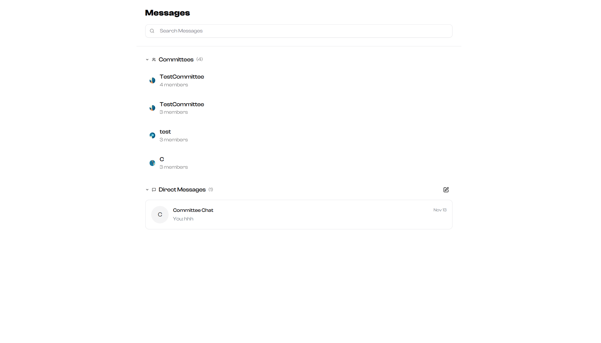

# Project Report: Ceros

## Demo Links

- **Demo Video**: [https://www.youtube.com/watch?v=AmSdPCBHlj4](#)
- **Hosted Site**: [https://ceros.netlify.app/](#)

## Features

- Real-time chat functionality.
  
  
- Committee and motion management.
  
  
- Friend management and social features.
  
- WebSocket-based live updates.
- RESTful API for backend operations.

## API Documentation

We have documented the detailed API endpoints in this link: [API Documentation](https://ceros.netlify.app/docs/api). The documenation below introduces some of the key endpoints.

### Authentication

- **POST /api/auth/login**: User login.
- **POST /api/auth/register**: User registration.

### Users

- **GET /api/users**: Fetch all users.
- **GET /api/users/:id**: Fetch user by ID.

### Friends

- **POST /api/friends**: Send a friend request.
- **DELETE /api/friends/:id**: Remove a friend.

### Committees

- **GET /api/committees**: Fetch all committees.
- **POST /api/committees**: Create a new committee.

### Motions

- **GET /api/motions**: Fetch all motions.
- **POST /api/motions**: Create a new motion.

## Database Schema

### Users Table

| Column   | Type         | Description           |
| -------- | ------------ | --------------------- |
| id       | UUID         | Unique identifier.    |
| username | VARCHAR(50)  | User's username.      |
| email    | VARCHAR(100) | User's email address. |
| password | TEXT         | Hashed password.      |

### Friends Table

| Column    | Type | Description        |
| --------- | ---- | ------------------ |
| id        | UUID | Unique identifier. |
| user_id   | UUID | ID of the user.    |
| friend_id | UUID | ID of the friend.  |

### Committees Table

| Column      | Type         | Description        |
| ----------- | ------------ | ------------------ |
| id          | UUID         | Unique identifier. |
| name        | VARCHAR(100) | Committee name.    |
| description | TEXT         | Committee details. |
